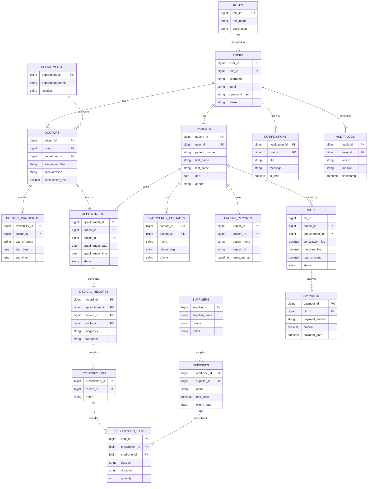

# Entity Relationship Diagram

## Core Relationships & ER Flow

The entity relationships within the Hospital Management System map user access control, patient healthcare journeys, clinical documentation, inventory tracking, and system audit trails.

---

## Relationship Pathways

### 1. User & Provider Hierarchy
```
Roles
  │
  ▼ (1 : N)
Users
  │
  ├──────► (1 : 1 / 0..1) Doctors
  │
  └──────► (1 : 1 / 0..1) Patients
```
- **Roles to Users**: One role can be assigned to multiple users (`1 : N`).
- **Users to Doctors**: A user account with the `DOCTOR` role maps to one doctor profile (`1 : 1`).
- **Users to Patients**: A user account with the `PATIENT` role maps to one patient profile (`1 : 0..1`).

---

### 2. Clinical Care Flow (Doctor Centric)
```
Doctors
  │
  ▼ (1 : N)
Appointments
  │
  ▼ (1 : 1)
Medical Records
  │
  ▼ (1 : N)
Prescriptions
  │
  ▼ (1 : N)
Prescription Items
  │
  ▼ (N : 1)
Medicines
```
- **Doctors to Appointments**: A doctor can have multiple scheduled appointments (`1 : N`).
- **Appointments to Medical Records**: Each completed appointment generates a single medical record (`1 : 1`).
- **Medical Records to Prescriptions**: A medical record can contain prescriptions (`1 : N`).
- **Prescriptions to Prescription Items**: A prescription lists individual medicine items (`1 : N`).
- **Prescription Items to Medicines**: Items reference specific catalog medicines (`N : 1`).

---

### 3. Patient Journey & Financial Operations
```
Patients
  │
  ├──────► (1 : N) Appointments
  │
  └──────► (1 : N) Bills
                    │
                    ▼ (1 : N)
                  Payments
```
- **Patients to Appointments**: A patient can book multiple appointments over time (`1 : N`).
- **Patients to Bills**: Charges generated across appointments aggregate into patient bills (`1 : N`).
- **Bills to Payments**: Each bill can have one or more payment transactions (`1 : N`).

---

### 4. Patient Media & Storage
```
Patients
  │
  ▼ (1 : N)
Patient Reports (AWS S3)
```
- **Patients to Reports**: A patient can have multiple diagnostic lab reports or imaging files stored in AWS S3 (`1 : N`).

---

### 5. System Administration & Audit Traces
```
Users
  │
  ├──────► (1 : N) Notifications
  │
  └──────► (1 : N) Audit Logs
```
- **Users to Notifications**: System alerts and messages delivered to specific user accounts (`1 : N`).
- **Users to Audit Logs**: All administrative actions and secure endpoint access events logged against user IDs (`1 : N`).


---

## Visual ER Diagram (Mermaid)

